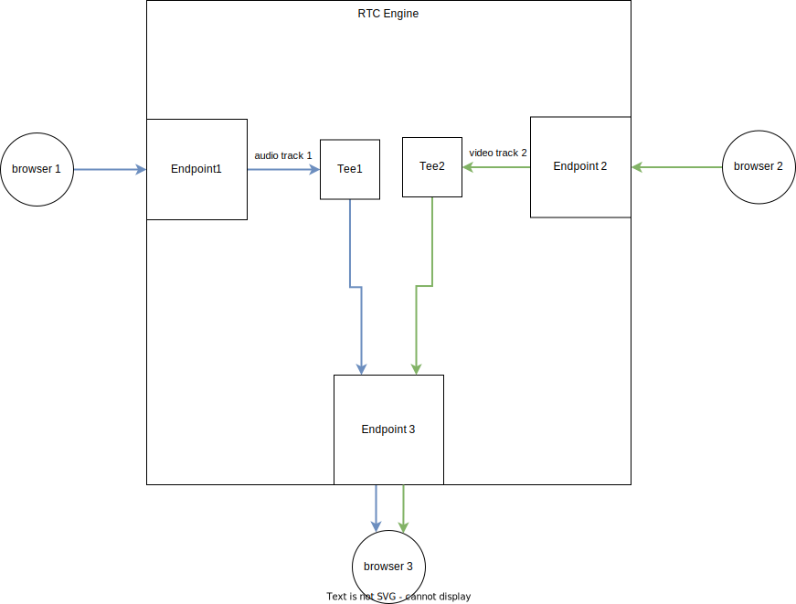

# Engine Architecture

The RTC Engine is responsible for forwarding tracks to proper endpoints.

We require tracks to be published in the form of RTP packets however, neither
engine nor tee has fields that are RTP or WebRTC specific.
Protocol specific logic should be handled inside specific endpoints.

The asumption that the engine is protocol agnostic greatly simplifies
its architecture and code while the asumption that a track has to be published
in the form of RTP packets allows us to put some WebRTC specific fields inside
track struct.

For each track there is a separate tee responsible for
forwarding this track to all subscribed endpoints.

