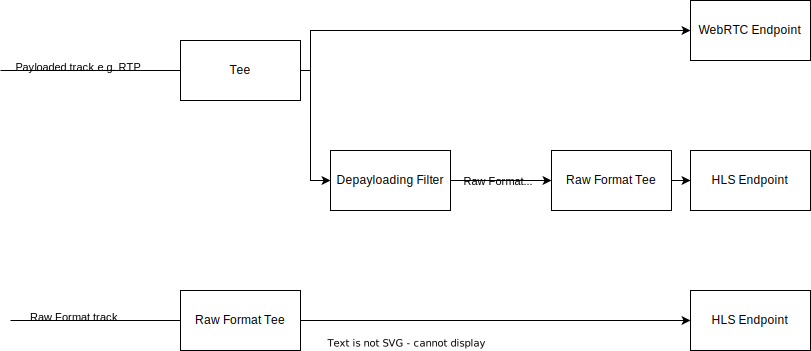

# Engine Architecture

Currently engine endpoints can publish two formats:
- non-raw - this situation is shown in the upper part of diagram
- raw - this situation is shown in the lower part of diagram

