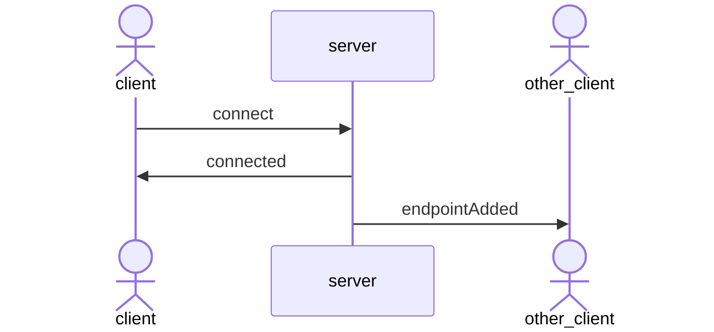
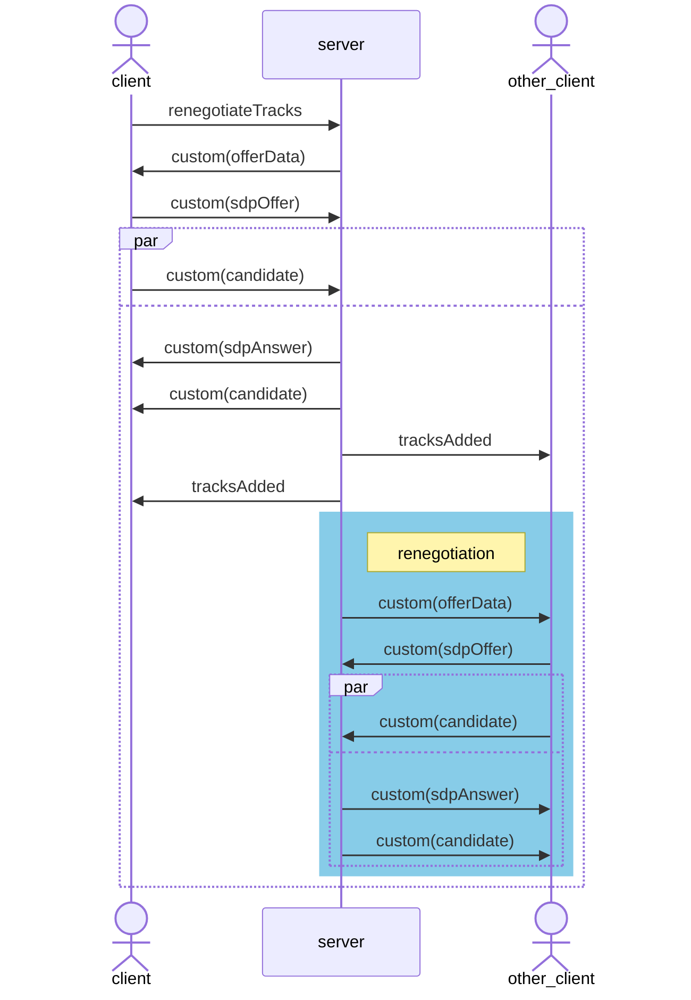
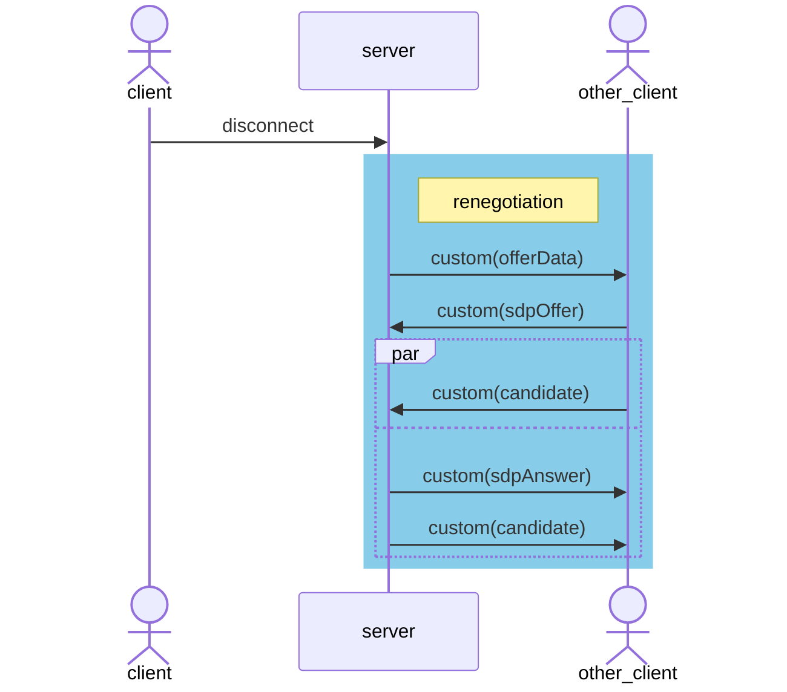

# Signaling Protocol

### Joining the server

```mermaid
sequenceDiagram
    actor client
    participant server
    actor other_client
    client->>server: connect
    server->>client: connected
    server->>other_client: endpointAdded
```

### Adding a track

```mermaid
sequenceDiagram
    actor client
    participant server
    actor other_client
    client->>server: renegotiateTracks
    server->>client: custom(offerData)
    client->>server: custom(sdpOffer)
    par
        client->>server: custom(candidate)
    and
        server->>client: custom(sdpAnswer)
        server->>client: custom(candidate)
        server->>other_client: tracksAdded
        server->>client: tracksAdded
        rect rgb(135, 204, 232)
            note right of server: renegotiation
            server->>other_client: custom(offerData)
            other_client->>server: custom(sdpOffer)
            par
                other_client->>server: custom(candidate)
            and
                server->>other_client: custom(sdpAnswer)
                server->>other_client: custom(candidate)
            end
        end
    end
```

### Leaving the server

```mermaid
sequenceDiagram
    actor client
    participant server
    actor other_client
    client->>server: disconnect
    rect rgb(135, 204, 232)
        note right of server: renegotiation
        server->>other_client: custom(offerData)
        other_client->>server: custom(sdpOffer)
        par
            other_client->>server: custom(candidate)
        and
            server->>other_client: custom(sdpAnswer)
            server->>other_client: custom(candidate)
        end
    end
```
