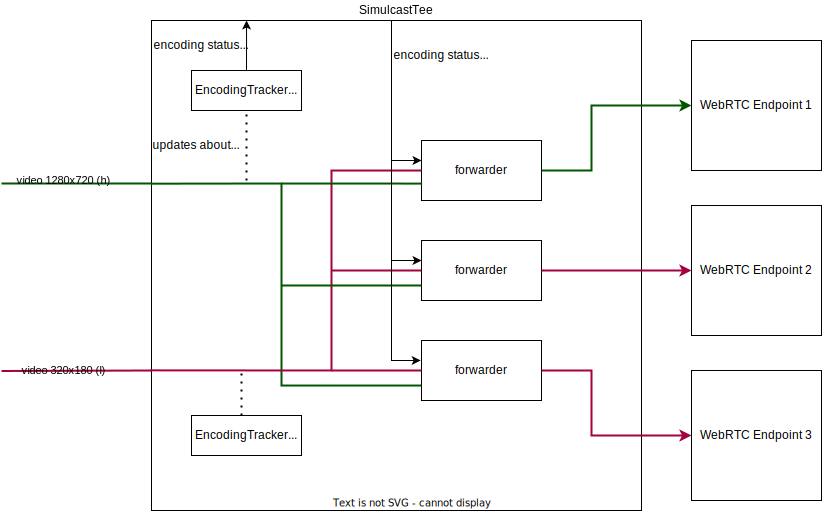

# Simulcast

Simulcast is a technique where a client sends multiple encodings of the same video to the server
and the server is responsbile for choosing and forwarding proper encoding to proper receiver (other client).
The encoding selection is dynamic (i.e. SFU switches between encodings in time) and it is based on:
* receiver awailable bandwidth
* receiver preferences (e.g. explicit request to receive video in HD resolution instead of FHD)
* UI layaout (e.g. videos being displayed in smaller video tiles will be sent in lower resolution)

At the moment, Membrane supports only receiver preferences i.e. receiver can chose which encoding
it is willing to receive.
Additionaly, sender can turn off/on specific encoding. 
Membrane RTC Engine will detect changes and switch to another available encoding.

## Codecs
At the moment, both H264 and VP8 codecs are supported.

## Logic
Switching between encodings has to be performed transparently from the receiver point of view.
This implies that:
* server has to rewrite some fields of RTP packets to avoid gaps in sequence numbers or timestamps after encoding switch i.e. receiver has to think it is still receiving the same RTP stream
* encoding switch has to be performed when server receives a keyframe from the new encoding. 
In other case video will freeze for a while after switching encodings. 

## Architecture

## Forwarder
It is responsible for forwarding proper encoding.
It encapsulates mungers (described below).

## Mungers

Mungers are responsible for modyfing RTP packets so that switching between encodings is transparent
for the receiver.
Currently, there are two mungers: RTP Munger and VP8 Munger. 
H264 doesn't require modyfing its RTP packets so there is no H264 Munger.

### RTP Munger

Rewrites RTP Header fields - sequence numbers and timestamps.
SSRC is being rewritten by other Membrane element.

### VP8 Munger

Rewrites VP8 RTP payload fields - keyidx, picture_id, tl0picidx

## EncodingTracker

Browser can pause sending some encoding when e.g. it doesn't have enough bandwidth.
This fact is not communicated to the server.
`EncodingTracker` is responsible for tracking encoding activity i.e. whether it is still active.
In our architecture, we create `EncodingTracker` per simulcast encoding.
Next, `SimulcastTee` polls information about encoding status every `x` seconds and
when some encoding is no longer active it informs all `Forwarders`.

## Disabling Simulcast

Simulcast can be disabled per WebRTC Endpoint.
At the moment, if client offers simulcast but we don't accept it, we will
disable the whole track.
This is not compliant with WebRTC standard as we should only remove SDP attributes 
related to simulcast and be prepared for receiving one encoding.
However, in such a case browser changes SSRC after ICE restart and 
we cannot handle this at the moment.
