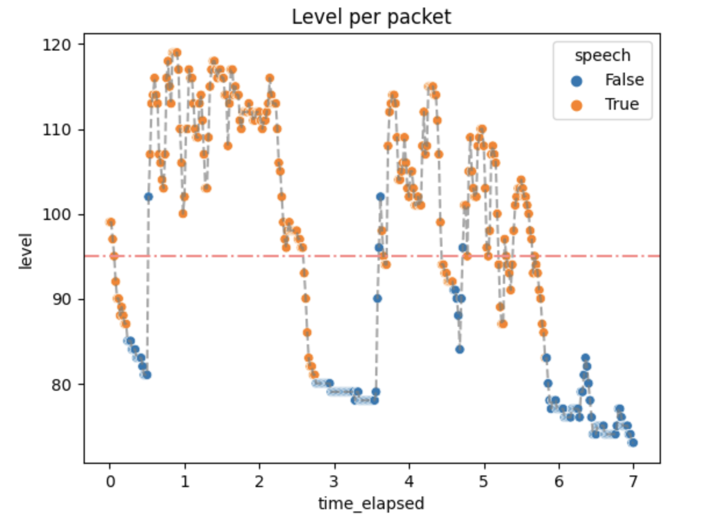
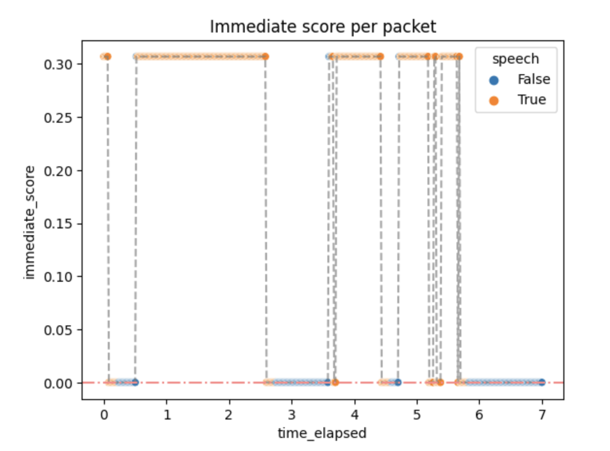
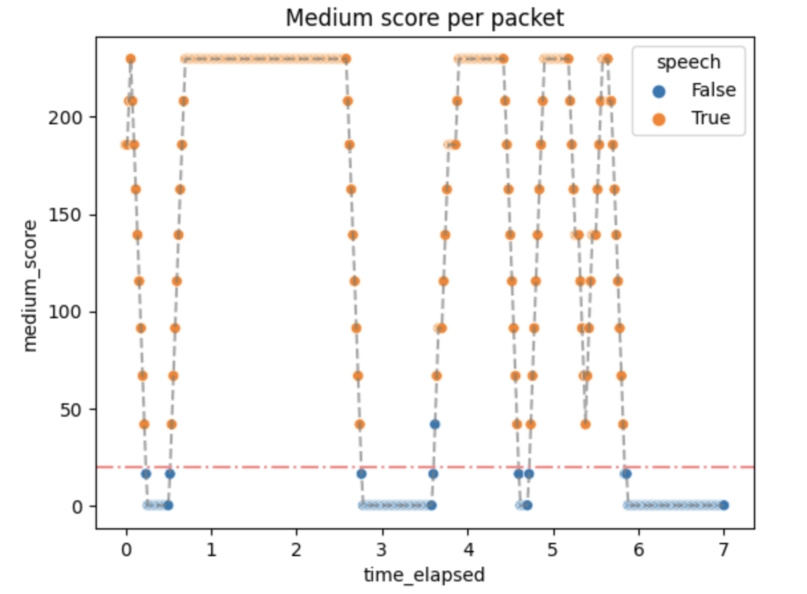
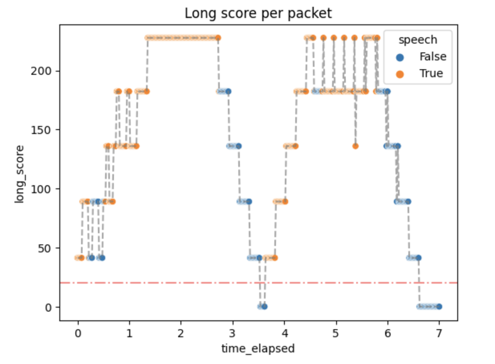

# Voice Activity Detection

_It's just thresholding with extra steps_

---

## Table of contents

1. [Introduction](#introduction)
2. [The algorithm](#the-algorithm)
3. [Implementation details](#implementation-details)
4. [_Tests, tests tests!_](#-tests--tests-tests--)
   - [Unit tests](#unit-tests)
   - [Manual tests](#manual-tests)
   - [Performance](#performance)
5. [Conclusions](#conclusions)
   - [Where it pans out...](#where-it-pans-out)
   - [...where it falls short...](#where-it-falls-short)
   - [...and what can be added.](#and-what-can-be-added)

## Introduction

Voice Activity Detection (or _VAD_ for short) is a technology that enables the automatic detection of speech activity in an audio signal. This is an essential tool for various applications such as speech recognition, speaker diarization, and voice communication systems.

In Videoroom, VAD is implemented as a part of the audio processing pipeline. When a user speaks, the VAD algorithm detects the presence of speech activity by analyzing the noise levels of the audio signal.

In Videoroom VAD is used for showing an indicator that the user is speaking. It can be seen in the upper left corner of the video tile.

Without further ado - let's dive into...

## The algorithm

First let's define the inputs and outputs of our function that would perform VAD. The function takes audio noise levels and the noise threshold value as inputs. It returns an information of whether the given audio levels indicate if the person is speaking based on the given threshold.

**Simple diagram of a function**

### The main idea

The main idea and many of the intricacies of the algorithm are provided in the original paper (that is ["Dominant Speaker Identification for Multipoint Videoconferencing" by Ilana Volfin and Israel Cohenthat](https://israelcohen.com/wp-content/uploads/2018/05/IEEEI2012_Volfin.pdf)). The following implementation was inspired by it.

Basically we take the input levels and group them into three layers of intervals: _immediates_, _mediums_ and _longs_. Intervals contain a finite number of subunits (levels contain immediates, mediums contain immediates and longs contain mediums). The intervals are then thresholded and labeled as _active_ or _inactive_. Based on the number of active intervals an _activity score_ is computed for each kind of intervals.

### In a little more detail

**The intervals**

There are three types of intervals:

- _immediates_ - smallest possible interval
- _mediums_ - a sample that is about as long as a word
- _longs_ - a sample that is about as long as a sentence

There are also internal parameters of the algorithm like:

- `@n1, @n2, @n3` - how many of the smaller intervals are in one bigger interval
  - `@n1` - levels in one immediate
  - `@n2` - immediates in one medium
  - `@n3` - mediums in one level
- `@mediums_subunit_threshold` - how many active immediates should the medium interval consist of to be counted as active
- `@long_subunit_threshold` - as above but given the mediums and a long interval

To compute them we take the input levels.

**Levels**

Then we combine them into immediates.

**A list of levels**

Then the imediates are counted as active or inactive based on the threshold provided.

**Thresholded immediates**

After that the mediums are computed in a similar fashion.

**Mediums computed and thresholded**

And after that longs.

**Long interval computed**

Typically there is only one long interval. This means that the maximum number of levels needed can be simply counted by multiplying `@n1`, `@n2` and `@n3` and therefore:

1.  The algorithm takes a constant number of audio levels.
2.  If the number of audio levels is smaller, it returns `:silence`.

**Activity score**

After computing the intervals, we take the most recent one from all 3 lengths and compute the activity score for each one.
The computed values are the also thresholded with another internal parameters named `@immediate_score_threshold`, `@medium_score_threshold` and `@long_score_threshold`.
If all the activity scores are above their threshold, the function returns `:speech`, otherwise `:false`.

**Image of the given items**

The activity score formula is taken directly from the paper. It is a loglikelihood of two probabilities: probability of speech and probability of silence. It is based on the number of active subunits in a unit. The details are provided in the aforementioned paper.

## Implementation details

The algorithm described above has it's implementation in the `IsSpekingEstimator` module of the `membrane_RTP_plugin`. It is then applied in the `VAD` membrane element located in the same plugin.

The membrane element:

- updates the queue in which the audio levels are stored
- rolls over if a packet with a different timestamp has been delivered
- sends the information only if the VAD status has changed

**Other useful information**:

1.  One packet = one membrane buffer.
2.  Every packet has about 20 ms of audio.
3.  Due to the current values of the `@nx` parameters, the algorithm needs less than 1.5 sec of initial audio to work.

## _Tests, tests tests!_

As every membrane element, this module is tested thoughtfully and thoroughly.

### Unit tests

The unit tests are implemented in the `VADTest` and `IsSpeakingEstimator` modules.

### Manual tests

The process of choosing internal parameters of the algorithm was not a trivial task. To have a better understanding of the inner workings of the algorithm, the vad was added to Videoroom and checked in terms of the return value and the activity scores it had produced.

The experiment consisted of telling the lines from Hamlet:

_Niech ryczy z bólu ranny łoś,_ (0.5 - 2.5 s) 
_zwierz zdrów przebiega knieje_ (3.5 - 5.75 s)

`True` values are expected in the aforementioned time ranges.

Then the audio levels along with the threshold and the actual results were plotted with the results given below.

Not every packet with a level above the threshold has `True` value. That is expected because we don't want the algorithm to be always active.

The activity scores were as follows:

Small activity scores mean that the packets above the threshold quickly generate `:speech` as output, but don't stop immediately. Of course it can be changed later.

### Performance

Some small performance tests were done in order to check if the algorithm is well-optimized and can serve in the real time communication environment.

The time of the whole `VAD.handle_process` was usually around 60 μs, which means no significant overhead. The number of reductions was around 210. This matches our needs.

## Conclusions

### Where it pans out...

The algorithm is better than a simple count of a running average or thresholding without any additions. It generates plausible results quickly and without a significant overhead. In short, the algorithm does what is expected.

### ...where it falls short...

As always, there can be room for improvement.

The number of parameters is big, especially for a simple algorithm like this. This makes it hard to parametrize well and may produce confusion for people that do not understand the algorithm that well.

The fixed threshold is not well suited for WebRTC and videoconferencing in general mostly because of different user audio settings and unspecified Auto Gain Control (AGC) behavior.

### ...and what can be added

**Dominant Speaker Detection**

In the context of video conferencing platforms such as Jitsi VAD is an important feature that allows for more efficient use of network resources by suppressing audio transmission during periods of silence. This can significantly reduce the bandwidth requirements and improve the overall quality of the communication.

Once speech is detected, the audio stream is transmitted to other participants in the conference. When the speech stops, the VAD algorithm detects the silence and stops transmitting the audio, thus reducing the network bandwidth usage.

A Dominant Speaker Detection like this could also be implemented in Videoroom. The estimation could be obtained from the activity scores computed during the described algorithm.

**Additional UI features in Videoroom**

Google Meet, Jitsi and many more WebRTC have _an animation_ for what looks as _continuous_ value returned by VAD. The indicator of speech moves along in correlation with how loud a person speaks.

For this to be completed in Videoroom, the activity score would need to be better adjusted.
