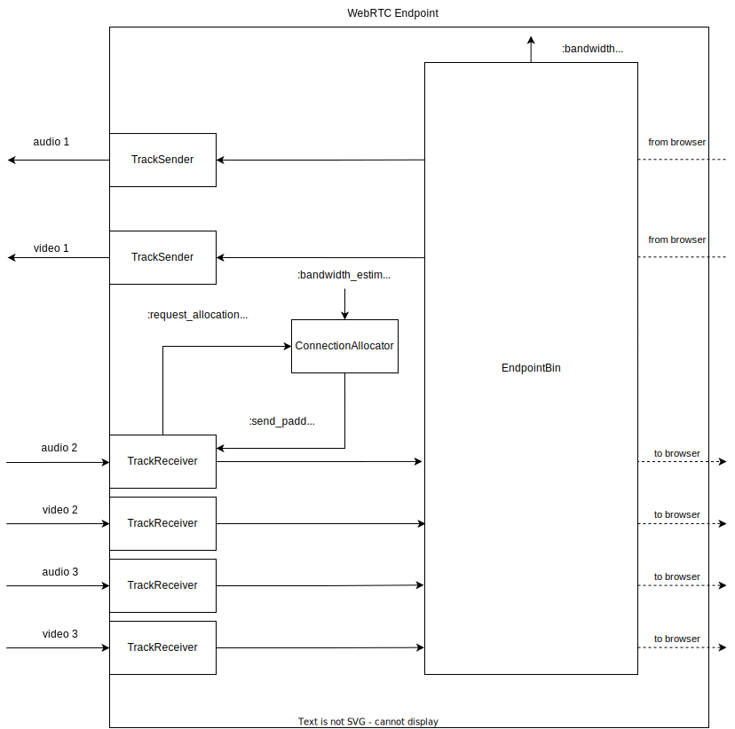

# WebRTC Endpoint

The WebRTC Endpoint is responsible for sending/receiving media tracks to/from a web borwser.

## Architecture

## Track Sender

TrackSender is responsible for observing track activity and publishing track data to the engine.
In particular, it is responsible for sending `Membrane.RTC.Engine.Event.TrackVariantResumed` 
and `Membrane.RTC.Engine.Event.TrackVariantPaused` events, and replying to `Membrane.KeyframeRequestEvent`.

#### VariantTracker

A browser can pause sending some encoding when e.g. it doesn't have enough bandwidth.
This fact is not communicated to the server.
`VariantTracker` is responsible for tracking variant activity i.e. whether it is still active.

## Track Receiver

TrackReceiver is responsible for receiving a track from the engine.
In particular, it is responsible for sending the `Membrane.RTC.Engine.Event.RequestTrackVariant` event, 
forwarding keyframe requests from the browser to the `TrackSender` and repairing RTP packets after
switching track variants.