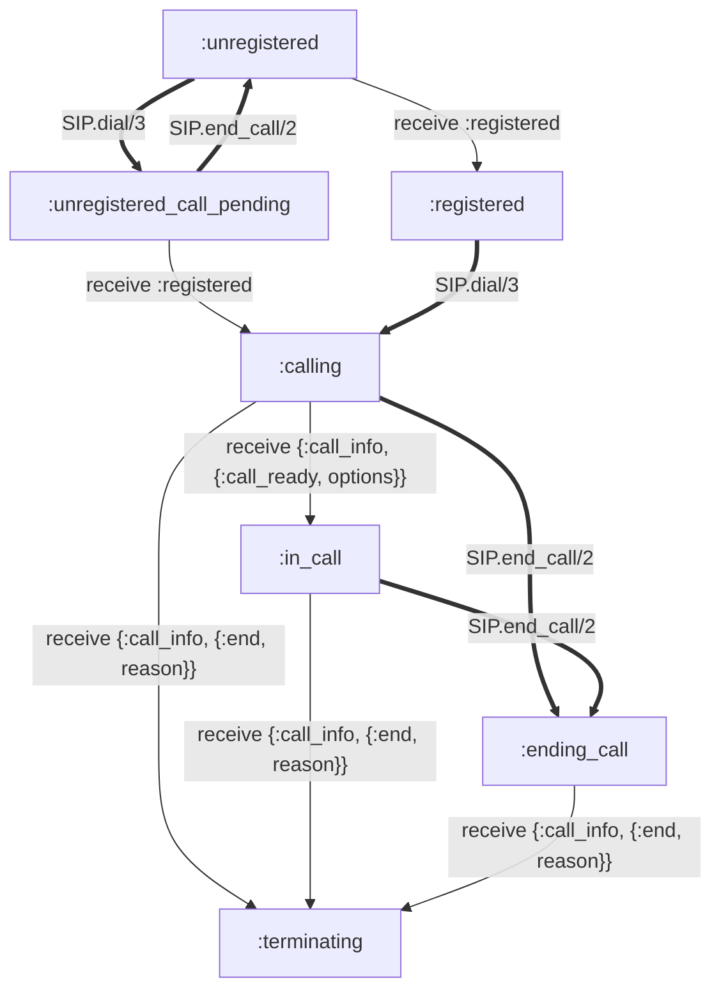

# SIP Endpoint

This document holds design information about the SIP Endpoint.

## Architecture

The Endpoint bla bla bla TODO WRITEME

### State diagram

```mermaid
flowchart TD
    U1[:unregistered] -->|receive :registered| R[:registered]
    U2[:unregistered_call_pending] -->|receive :registered| C[:calling]
    U1 ==>|SIP.dial/3| U2
    U2 ==>|SIP.end_call/2| U1
    R ==>|SIP.dial/3| C
    C -->|"receive {:call_info, {:call_ready, options}}"| I[:in_call]
    C & I ==>|SIP.end_call/2| E[:ending_call]
    C & I & E -->|"receive {:call_info, {:end, reason}}"| T[:terminating]
```
